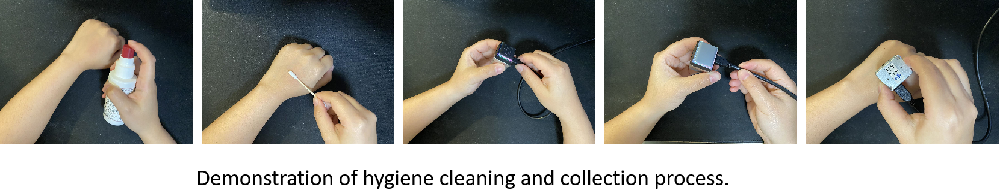

# Solution for the gelsight_lab assignment

run `../demos/mini_tracking_linux_V0/tracking_answers.py`

### Shear force visualization


### Twist force visualization


### Operation Demonstration



## Calculating Real-World Displacement from GelSight Image Movement

To calculate how much a point on the image moves in real-world terms when it shifts by 10 pixels, we need to understand the relationship between the image's pixel dimensions and the real-world dimensions (Field of View).

### Given GelSight Mini Specifications:

- **Image Width (imgw):** 320 pixels
- **Image Height (imgh):** 240 pixels
- **Field of View (FOV):** 18.6 mm (Horizontal) x 14.3 mm (Vertical)
- **Movement:** 10 pixels

### Steps:

1. **Calculate the real-world size of one pixel:**

```text
Horizontal size per pixel = 18.6 mm / 320 pixels = 0.058125 mm/pixel
Vertical size per pixel   = 14.3 mm / 240 pixels = 0.059583 mm/pixel
```

2. **Calculate the real-world movement for 10 pixels:**

```text
Horizontal movement = 10 pixels * 0.058125 mm/pixel = 0.58125 mm
Vertical movement   = 10 pixels * 0.059583 mm/pixel = 0.59583 mm
```

Thus, when a point on the image moves 10 pixels, it moves approximately **0.58125 mm horizontally** and **0.59583 mm vertically** in the real world.

---

## Shear Force Estimation Method

The **Simplified Shear Force Estimation Method** calculates the force exerted on the skin when it undergoes displacement. This method uses the displacement, skin thickness, and the shear modulus to estimate the resulting shear force.

### Definitions:

- **Shear Strain (γ)**: Displacement per unit thickness of the skin layer:
  
  ```text
  γ = Δx / d
  ```

  where:
  - Δx is the displacement (in mm)
  - d is the thickness of the skin layer (in mm)

- **Shear Stress (τ)**: Shear stress is related to shear strain using the shear modulus (G):

  ```text
  τ = G * (Δx / d)
  ```

  where:
  - G is the shear modulus (in Pa)

- **Shear Force (F)**: Shear force is obtained by multiplying the shear stress by the contact area (A):

  ```text
  F = G * (Δx / d) * A
  ```

  where:
  - A is the contact area (in m²)

---

## Twist Force Estimation Method

The **Simplified Twist Force Estimation Method** estimates the force due to twisting or rotational displacement of the skin. This method uses the concept of torsional strain and torque.

### Definitions:

- **Torsional Strain (γₜ)**: Angular displacement per unit radius of the skin layer:

  ```text
  γₜ = θ / r
  ```

  where:
  - θ is the angular displacement (in radians)
  - r is the radius of the area being twisted (in meters)

- **Torsional Stress (τₜ)**: Torsional stress is related to torsional strain using the torsional shear modulus (Gₜ):

  ```text
  τₜ = Gₜ * (θ / r)
  ```

  where:
  - Gₜ is the torsional shear modulus (in Pa)

- **Torque (T)**: Torque (or twist force) is calculated by multiplying the torsional stress by the moment of area (J):

  ```text
  T = Gₜ * (θ / r) * J
  ```

  where:
  - J is the polar moment of inertia (in m⁴), which depends on the geometry of the twisted area.

---

These simplified methods offer a foundational approach for estimating the mechanical interactions between the skin and external forces. They provide a basis for further refinement in experimental or more complex scenarios.


